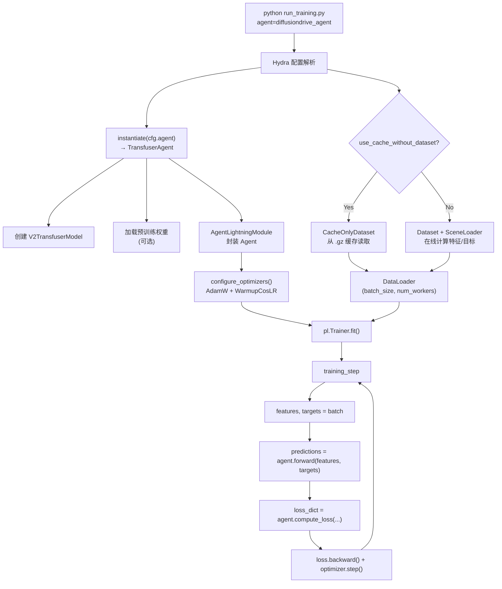
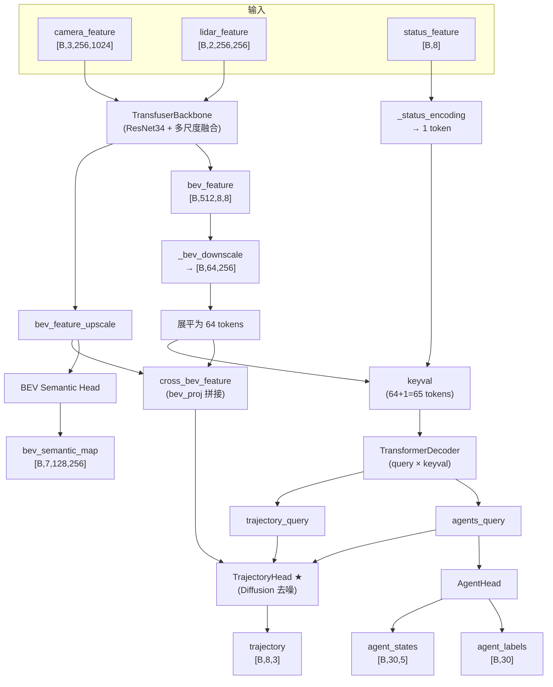

# DiffusionDrive 代码导读

> 基于 NAVSIM 框架的自动驾驶轨迹规划方法，核心创新是将 **Diffusion 去噪** 引入端到端驾驶规划。

---

## 目录

- [1. 项目结构概览](#1-项目结构概览)
- [2. 程序执行流程](#2-程序执行流程)
  - [2.1 训练流程总览](#21-训练流程总览)
  - [2.2 推理流程总览](#22-推理流程总览)
- [3. 核心模块详解](#3-核心模块详解)
  - [3.1 入口与配置系统（Hydra）](#31-入口与配置系统hydra)
  - [3.2 数据加载](#32-数据加载)
  - [3.3 Agent 接口](#33-agent-接口)
  - [3.4 模型架构（V2TransfuserModel）](#34-模型架构v2transfusermodel)
  - [3.5 Diffusion 轨迹头（核心创新）](#35-diffusion-轨迹头核心创新)
  - [3.6 损失函数](#36-损失函数)
- [4. 关键流程图](#4-关键流程图)
  - [4.1 训练完整流程图](#41-训练完整流程图)
  - [4.2 模型 Forward 流程图](#42-模型-forward-流程图)
  - [4.3 Diffusion 轨迹预测流程图](#43-diffusion-轨迹预测流程图)
- [5. 配置系统层次](#5-配置系统层次)
- [6. Ubuntu 完整编译运行指南](#6-ubuntu-完整编译运行指南)
  - [6.1 前置依赖](#61-step-0前置依赖)
  - [6.2 创建环境并安装依赖](#62-step-1创建-conda-环境并安装依赖)
  - [6.3 设置环境变量](#63-step-2设置环境变量)
  - [6.4 下载数据](#64-step-3下载数据)
  - [6.5 预缓存数据集](#65-step-4预缓存数据集推荐)
  - [6.6 启动训练](#66-step-5启动训练)
  - [6.7 评测模型](#67-step-6评测模型)
  - [6.8 可视化查看结果](#68-step-7可视化查看结果)
- [7. 常见问题排查](#7-常见问题排查)
- [8. 代码阅读推荐顺序](#8-代码阅读推荐顺序)

---

## 1. 项目结构概览

```
DiffusionDrive/
├── navsim/
│   ├── agents/
│   │   ├── abstract_agent.py              # Agent 抽象基类
│   │   ├── transfuser/                    # TransFuser baseline
│   │   │   ├── transfuser_agent.py
│   │   │   ├── transfuser_model.py
│   │   │   ├── transfuser_config.py
│   │   │   ├── transfuser_features.py
│   │   │   ├── transfuser_loss.py
│   │   │   └── transfuser_callback.py
│   │   └── diffusiondrive/               # ★ DiffusionDrive 核心实现
│   │       ├── transfuser_agent.py        # Agent 接口（继承 AbstractAgent）
│   │       ├── transfuser_model_v2.py     # ★ 模型主体（V2TransfuserModel）
│   │       ├── transfuser_config.py       # 全局配置 dataclass
│   │       ├── transfuser_features.py     # 特征 & 目标构建器
│   │       ├── transfuser_loss.py         # 多任务损失
│   │       ├── transfuser_callback.py     # 训练回调 & 可视化
│   │       └── modules/
│   │           ├── blocks.py              # MLP、位置编码、BEV 采样注意力
│   │           ├── conditional_unet1d.py  # 正弦时间步编码
│   │           ├── multimodal_loss.py     # 多模态轨迹损失（Focal + L1）
│   │           └── scheduler.py           # Warmup + Cosine 学习率调度
│   ├── common/
│   │   ├── dataclasses.py                 # 核心数据结构定义
│   │   └── dataloader.py                  # SceneLoader 实现
│   └── planning/
│       ├── script/
│       │   ├── run_training.py            # ★ 训练入口
│       │   ├── run_pdm_score.py           # 评测入口
│       │   ├── run_dataset_caching.py     # 数据预缓存
│       │   └── config/                    # Hydra 配置文件
│       │       ├── training/
│       │       │   └── default_training.yaml
│       │       └── common/
│       │           ├── agent/
│       │           │   └── diffusiondrive_agent.yaml
│       │           └── train_test_split/
│       └── training/
│           ├── agent_lightning_module.py   # PyTorch Lightning 训练封装
│           ├── dataset.py                 # Dataset & CacheOnlyDataset
│           └── abstract_feature_target_builder.py
└── scripts/
    └── training/
        └── run_transfuser_training.sh     # 训练启动脚本
```

---

## 2. 程序执行流程

### 2.1 训练流程总览

```
启动命令 (python run_training.py agent=diffusiondrive_agent ...)
    │
    ▼
┌─────────────────────────────────────────────────┐
│  Hydra 配置解析                                    │
│  合并 default_training.yaml + agent yaml + CLI    │
└────────────────────┬────────────────────────────┘
                     │
                     ▼
┌─────────────────────────────────────────────────┐
│  instantiate(cfg.agent) → TransfuserAgent        │
│  内部创建 V2TransfuserModel + 加载预训练权重       │
└────────────────────┬────────────────────────────┘
                     │
                     ▼
┌─────────────────────────────────────────────────┐
│  构建 Dataset / CacheOnlyDataset                  │
│  ├─ FeatureBuilder: 相机、LiDAR、自车状态          │
│  └─ TargetBuilder:  轨迹、Agent框、BEV语义图       │
└────────────────────┬────────────────────────────┘
                     │
                     ▼
┌─────────────────────────────────────────────────┐
│  AgentLightningModule 封装 Agent                   │
│  配置 optimizer (AdamW) + scheduler (WarmupCosLR)  │
└────────────────────┬────────────────────────────┘
                     │
                     ▼
┌─────────────────────────────────────────────────┐
│  pl.Trainer.fit()                                  │
│  每个 step:                                        │
│    features, targets = batch                       │
│    predictions = agent.forward(features, targets)  │
│    loss = agent.compute_loss(...)                   │
│    loss.backward()                                  │
└─────────────────────────────────────────────────┘
```

### 2.2 推理流程总览

```
AgentInput (相机图像 + LiDAR + 自车状态)
    │
    ▼
FeatureBuilder.compute_features(agent_input)
    │ → camera_feature, lidar_feature, status_feature
    ▼
agent.forward(features)
    │
    ├─ Backbone: 图像 + LiDAR → BEV 特征
    ├─ Transformer Decoder → trajectory_query, agents_query
    ├─ TrajectoryHead (Diffusion 去噪 2 步) → 20 条候选轨迹
    └─ 选最优 mode → trajectory (8×3)
    │
    ▼
Trajectory(poses)  →  输出最终规划轨迹
```

---

## 3. 核心模块详解

### 3.1 入口与配置系统（Hydra）

**入口**：`navsim/planning/script/run_training.py`

```python
CONFIG_PATH = "config/training"          # 相对于脚本所在目录
CONFIG_NAME = "default_training"

@hydra.main(config_path=CONFIG_PATH, config_name=CONFIG_NAME)
def main(cfg: DictConfig):
    agent = instantiate(cfg.agent)       # 根据 yaml 实例化 Agent
    lightning_module = AgentLightningModule(agent)
    train_data, val_data = build_datasets(cfg, agent)
    trainer = pl.Trainer(**cfg.trainer.params)
    trainer.fit(lightning_module, train_dataloader, val_dataloader)
```

Hydra 配置查找路径为 `config/training` + searchpath `config/common`，所以 `agent: diffusiondrive_agent` 对应 `config/common/agent/diffusiondrive_agent.yaml`。

### 3.2 数据加载

**两种 Dataset 模式**：

| 模式 | 类 | 说明 |
|------|-----|------|
| 在线计算 | `Dataset` | 从原始 pkl 加载 Scene，实时构建特征/目标 |
| 纯缓存 | `CacheOnlyDataset` | 直接从 `.gz` 文件读取，不需要原始数据 |

**数据流**：

```
原始数据 (pkl + sensor_blobs)
    → SceneLoader.filter_scenes() 过滤
    → SceneLoader.get_scene_from_token(token) 得到 Scene
    → FeatureBuilder.compute_features(agent_input) → features dict
    → TargetBuilder.compute_targets(scene) → targets dict
    → DataLoader 自动 collate → batch
```

**缓存结构**：

```
{cache_path}/{log_name}/{token}/
    ├── transfuser_feature.gz    # gzip + pickle
    └── transfuser_target.gz
```

**特征构建 (TransfuserFeatureBuilder)**：

| 特征 | 来源 | 形状 |
|------|------|------|
| `camera_feature` | 左/前/右相机拼接 → resize | `[3, 256, 1024]` |
| `lidar_feature` | 点云 → 2D 直方图 | `[2, 256, 256]` |
| `status_feature` | 驾驶指令 + 速度 + 加速度 | `[8]` |

**目标构建 (TransfuserTargetBuilder)**：

| 目标 | 说明 | 形状 |
|------|------|------|
| `trajectory` | 未来轨迹 (x, y, heading) | `[8, 3]` |
| `agent_states` | 周围物体 2D 框 (x,y,heading,l,w) | `[30, 5]` |
| `agent_labels` | 物体存在性标签 | `[30]` |
| `bev_semantic_map` | 6 类 BEV 语义图 | `[128, 256]` |

### 3.3 Agent 接口

`AbstractAgent(nn.Module)` 定义了统一接口：

```
AbstractAgent
├── name() → str
├── get_sensor_config() → SensorConfig
├── get_feature_builders() → List[FeatureBuilder]
├── get_target_builders() → List[TargetBuilder]
├── forward(features, targets) → predictions
├── compute_loss(features, targets, predictions) → loss
├── get_optimizers() → optimizer + scheduler
├── get_training_callbacks() → List[Callback]
└── compute_trajectory(agent_input) → Trajectory    # 推理入口
```

DiffusionDrive 的 `TransfuserAgent` 实现了上述接口，核心在于：
- `forward()` 调用 `V2TransfuserModel`
- `get_optimizers()` 返回 AdamW + WarmupCosLR（支持 backbone 差异化学习率）

### 3.4 模型架构（V2TransfuserModel）

```
┌──────────────────────────────────────────────────────────────┐
│                      V2TransfuserModel                        │
│                                                                │
│  ┌───────────┐   ┌───────────┐                                 │
│  │  Camera    │   │  LiDAR    │                                 │
│  │  Encoder   │   │  Encoder  │                                 │
│  │ (ResNet34) │   │ (ResNet34)│                                 │
│  └─────┬─────┘   └─────┬─────┘                                 │
│        │               │                                        │
│        └───────┬───────┘                                        │
│                ▼                                                │
│  ┌──────────────────────┐                                      │
│  │  TransfuserBackbone   │  ← 多尺度 cross-attention 融合        │
│  │  (图像 + LiDAR → BEV) │                                      │
│  └──────┬───────────────┘                                      │
│         │                                                       │
│    ┌────┴────┐                                                  │
│    ▼         ▼                                                  │
│ bev_feature  bev_feature_upscale                                │
│    │                │                                           │
│    ▼                │                                           │
│ [降维+展平] + status_encoding → keyval (65 tokens)              │
│    │                                                            │
│    ▼                                                            │
│ TransformerDecoder(query, keyval)                               │
│    │                                                            │
│    ├→ trajectory_query ──→ TrajectoryHead ★ (Diffusion)         │
│    │                          │ + cross_bev_feature             │
│    │                          │ + agents_query                  │
│    │                          ▼                                 │
│    │                      trajectory (8×3)                      │
│    │                                                            │
│    ├→ agents_query ──→ AgentHead → agent_states + agent_labels  │
│    │                                                            │
│    └→ bev_feature ──→ BEV Semantic Head → bev_semantic_map      │
└──────────────────────────────────────────────────────────────┘
```

### 3.5 Diffusion 轨迹头（核心创新）

DiffusionDrive 使用 **Truncated Diffusion** + **Anchor-based 多模态**：

**关键组件**：
- `plan_anchor`：20 条 K-means 聚类得到的锚轨迹 (20×8×2)
- `DDIMScheduler`：扩散调度器（50 步训练，2 步推理）
- `CustomTransformerDecoder`：2 层去噪解码器

**训练**（forward_train）：

```
plan_anchor (20×8×2)
    → 归一化 → 加噪 (随机 timestep ∈ [0,50])
    → 反归一化 → 正弦位置编码
    → plan_anchor_encoder → traj_feature
    → time_mlp(timestep) → time_embed

2 层 CustomTransformerDecoderLayer 迭代：
    ├── GridSampleCrossBEVAttention (轨迹点 → BEV 网格采样)
    ├── cross_agent_attention (与 agents_query 交互)
    ├── cross_ego_attention (与 ego_query 交互)
    ├── FFN
    ├── ModulationLayer (时间步 scale-shift 调制)
    └── 输出 poses_reg (回归偏移), poses_cls (20 类分类)

LossComputer: Focal 分类损失 + L1 回归损失
```

**推理**（forward_test）：

```
从 t=8 开始，DDIM 2 步去噪：
    step 1: t=8 → 编码 → 解码 → 预测 x_start → scheduler.step
    step 2: t=0 → 编码 → 解码 → 预测 x_start → scheduler.step

最终按 poses_cls 选最优 mode → 输出 trajectory
```

**推理只需 2 步去噪**，相比标准 Diffusion 大幅加速。

### 3.6 损失函数

多任务联合训练：

```
total_loss = trajectory_weight    × trajectory_loss     (12.0)
           + diff_loss_weight     × diffusion_loss      (20.0)
           + agent_class_weight   × agent_class_loss    (10.0)
           + agent_box_weight     × agent_box_loss      ( 1.0)
           + bev_semantic_weight  × bev_semantic_loss   (14.0)
```

| 损失项 | 计算方式 | 说明 |
|--------|----------|------|
| trajectory_loss | Focal 分类 + L1 回归 | 由 TrajectoryHead 中 LossComputer 计算 |
| diffusion_loss | MSE 噪声预测 | Diffusion 去噪目标 |
| agent_class_loss | BCE | 物体存在性（Hungarian 匹配后） |
| agent_box_loss | L1 | 物体框回归（Hungarian 匹配后） |
| bev_semantic_loss | CrossEntropy | BEV 语义分割 |

Agent 检测损失使用 **Hungarian 匹配**（`linear_sum_assignment`）进行预测与 GT 的一对一配对。

---

## 4. 关键流程图

### 4.1 训练完整流程图



### 4.2 模型 Forward 流程图



### 4.3 Diffusion 轨迹预测流程图

```mermaid
flowchart TD
    subgraph 训练
        PA["plan_anchor<br/>(20条锚轨迹)"] --> NORM["归一化 norm_odo"]
        NORM --> NOISE["加噪<br/>scheduler.add_noise<br/>随机 t ∈ [0,50]"]
        NOISE --> DENORM["反归一化"]
        DENORM --> PE["正弦位置编码"]
        PE --> ENC["plan_anchor_encoder"]
        
        T_STEP["随机 timestep"] --> TM["time_mlp → time_embed"]
        
        ENC --> DEC["CustomTransformerDecoder<br/>(2层)"]
        TM --> DEC
        
        DEC --> REG["poses_reg (回归偏移)"]
        DEC --> CLS["poses_cls (20类分类)"]
        
        REG --> LC["LossComputer<br/>Focal + L1"]
        CLS --> LC
    end
    
    subgraph 推理
        PA2["plan_anchor"] --> S1["DDIM Step 1: t=8→4"]
        S1 --> S2["DDIM Step 2: t=4→0"]
        S2 --> SEL["按 poses_cls 选最优 mode"]
        SEL --> OUT["最终轨迹 (8×3)"]
    end
```



---

## 5. 配置系统层次

```
default_training.yaml (训练主配置)
│
├── defaults:
│   ├── default_common.yaml ─────── 环境变量、路径
│   ├── default_evaluation.yaml ─── navsim_log_path, sensor_blobs_path
│   ├── default_train_val_test_log_split.yaml ─── train/val/test log 列表
│   └── agent: diffusiondrive_agent.yaml ──── Agent 类 + 模型配置
│
├── split: trainval
├── cache_path: ${NAVSIM_EXP_ROOT}/training_cache
├── use_cache_without_dataset: false
├── force_cache_computation: true
├── seed: 0
│
├── dataloader:
│   └── params: {batch_size: 64, num_workers: 4, ...}
│
└── trainer:
    └── params: {max_epochs: 100, accelerator: gpu, strategy: ddp, precision: 16-mixed, ...}
```

Agent 配置文件 (`diffusiondrive_agent.yaml`) 指定了：
- `_target_`: 要实例化的 Agent 类
- `config._target_`: 要实例化的 Config dataclass
- `lr`: 学习率
- `checkpoint_path`: 预训练权重路径

---

## 6. Ubuntu 完整编译运行指南

### 6.1 Step 0：前置依赖

```bash
# 系统级依赖
sudo apt update && sudo apt install -y \
    build-essential cmake git wget unzip \
    libglib2.0-0 libsm6 libxext6 libxrender-dev \
    libgl1-mesa-glx libgeos-dev

# 安装 Miniconda（如果还没有的话）
wget https://repo.anaconda.com/miniconda/Miniconda3-latest-Linux-x86_64.sh
bash Miniconda3-latest-Linux-x86_64.sh
source ~/.bashrc  
# 安装之后需要重新打开一个终端
```

### 6.2 Step 1：创建 conda 环境并安装依赖

```bash
cd /data/ws/DiffusionDrive

# 接受 main 频道的服务条款
conda tos accept --override-channels --channel https://repo.anaconda.com/pkgs/main

# 接受 r 频道的服务条款
conda tos accept --override-channels --channel https://repo.anaconda.com/pkgs/r

# 创建 conda 环境
conda create -n navsim python=3.9 -y
conda activate navsim

# 安装 PyTorch（根据你的 CUDA 版本选择，以下以 CUDA 11.8 为例）
pip install torch==2.0.1 torchvision==0.15.2 --index-url https://download.pytorch.org/whl/cu118

# 安装项目及其依赖
pip install -e .

# 安装 DiffusionDrive 额外依赖
pip install diffusers einops
```

> **注意**：`requirements.txt` 会自动安装 `nuplan-devkit`（从 GitHub），这一步可能较慢。如果网络不好，可以预先克隆 `nuplan-devkit` 后本地安装。

### 6.3 Step 2：设置环境变量

在 `~/.bashrc` 中添加（或每次启动终端时手动 export）：

```bash
# DiffusionDrive 项目根目录
export NAVSIM_DEVKIT_ROOT="/data/ws/DiffusionDrive"

# 数据存放根目录（需要较大磁盘空间）
export OPENSCENE_DATA_ROOT="/data/openscene_data"

# 实验输出目录（训练缓存、模型权重、评测结果）
export NAVSIM_EXP_ROOT="/data/experiments"

# 创建目录
mkdir -p $OPENSCENE_DATA_ROOT $NAVSIM_EXP_ROOT
```

| 环境变量 | 用途 | 磁盘需求 |
|----------|------|----------|
| `NAVSIM_DEVKIT_ROOT` | 项目代码根目录 | ~1 GB |
| `OPENSCENE_DATA_ROOT` | 原始数据 (navsim_logs + sensor_blobs + maps) | mini ~20GB, trainval ~500GB |
| `NAVSIM_EXP_ROOT` | 训练缓存 + 模型权重 + 评测输出 | ~50-100 GB |

### 6.4 Step 3：下载数据

#### 方案 A：用 mini 集快速验证（推荐先用这个跑通流程）

```bash
cd $OPENSCENE_DATA_ROOT

# 下载 mini 集（metadata + camera + lidar）
cd $NAVSIM_DEVKIT_ROOT/download/
sed -i 's/\r//' download_mini.sh
bash download_mini.sh

# 下载 nuPlan 地图
cd $NAVSIM_DEVKIT_ROOT/download/
sed -i 's/\r//' download_maps.sh
bash download_maps.sh
```

下载完成后，需要整理目录结构：

```bash
# 整理成标准目录结构
mkdir -p navsim_logs sensor_blobs

mv mini_navsim_logs navsim_logs/mini
mv mini_sensor_blobs sensor_blobs/mini

# 地图放到 nuplan-devkit 期望的位置
mkdir -p ~/nuplan/dataset
ln -s $OPENSCENE_DATA_ROOT/maps ~/nuplan/dataset/maps
```

#### 方案 B：用完整 trainval 集训练

```bash
cd $OPENSCENE_DATA_ROOT

# 完整数据集（200 个 camera 分片 + 200 个 lidar 分片，非常大）
bash $NAVSIM_DEVKIT_ROOT/download/download_trainval.sh

# 也可以用并行下载加速
# bash $NAVSIM_DEVKIT_ROOT/download/super_download.sh

# 下载 nuPlan 地图
bash $NAVSIM_DEVKIT_ROOT/download/download_maps.sh

# 整理目录
mkdir -p navsim_logs sensor_blobs
mv trainval_navsim_logs navsim_logs/trainval
mv trainval_sensor_blobs sensor_blobs/trainval
mkdir -p ~/nuplan/dataset
ln -s $OPENSCENE_DATA_ROOT/maps ~/nuplan/dataset/maps
```

#### 下载预训练权重和 Anchor 文件

```bash
# 1. 下载 ResNet-34 预训练权重
mkdir -p $OPENSCENE_DATA_ROOT/pretrained
wget -O $OPENSCENE_DATA_ROOT/pretrained/resnet34.bin \
    "https://huggingface.co/timm/resnet34.a1_in1k/resolve/main/pytorch_model.bin"

# 2. 下载 K-means 聚类锚轨迹
wget -O $OPENSCENE_DATA_ROOT/pretrained/kmeans_navsim_traj_20.npy \
    "https://github.com/hustvl/DiffusionDrive/releases/download/DiffusionDrive_88p1_PDMS_Eval_file/kmeans_navsim_traj_20.npy"

# 3.（可选）下载官方训练好的 checkpoint 用于评测
mkdir -p $NAVSIM_EXP_ROOT/checkpoints
# 从 https://huggingface.co/hustvl/DiffusionDrive 下载 .pth 文件
```

#### 修改配置中的路径

打开 `navsim/agents/diffusiondrive/transfuser_config.py`，修改第 18-19 行：

```python
bkb_path: str = "/data/openscene_data/pretrained/resnet34.bin"
plan_anchor_path: str = "/data/openscene_data/pretrained/kmeans_navsim_traj_20.npy"
```

> 将路径改为你实际下载的位置。

#### 最终数据目录结构

```
${OPENSCENE_DATA_ROOT}/                    # /data/openscene_data
├── navsim_logs/
│   ├── mini/                              # mini 集元数据 (.pkl)
│   └── trainval/                          # trainval 集元数据
├── sensor_blobs/
│   ├── mini/                              # mini 集传感器数据 (图像、点云)
│   └── trainval/                          # trainval 集传感器数据
├── maps/                                  # nuPlan 地图
│   ├── sg-one-north/
│   ├── us-ma-boston/
│   ├── us-nv-las-vegas-strip/
│   └── us-pa-pittsburgh-hazelwood/
└── pretrained/
    ├── resnet34.bin                        # ResNet-34 预训练权重
    └── kmeans_navsim_traj_20.npy           # 20 条锚轨迹
```

### 6.5 Step 4：预缓存数据集（推荐）

缓存可以将数据预处理结果存为 `.gz` 文件，极大加速训练时的数据加载：

```bash
conda activate navsim
cd $NAVSIM_DEVKIT_ROOT

# 缓存训练数据（使用 mini 集验证时把 navtrain 改为 navmini）
python navsim/planning/script/run_dataset_caching.py \
    agent=diffusiondrive_agent \
    experiment_name=training_diffusiondrive_agent \
    train_test_split=navmini

# 缓存评测 metric（评测时必须）
python navsim/planning/script/run_metric_caching.py \
    train_test_split=navtest \
    cache.cache_path=$NAVSIM_EXP_ROOT/metric_cache
```

### 6.6 Step 5：启动训练

#### 单 GPU 训练

```bash
conda activate navsim
cd $NAVSIM_DEVKIT_ROOT

python navsim/planning/script/run_training.py \
    agent=diffusiondrive_agent \
    experiment_name=training_diffusiondrive_agent \
    train_test_split=navtrain \
    split=trainval \
    trainer.params.max_epochs=100 \
    cache_path="${NAVSIM_EXP_ROOT}/training_cache/" \
    use_cache_without_dataset=True \
    force_cache_computation=False
```

#### 多 GPU 训练 (DDP)

```bash
# 自动使用所有可见 GPU
python navsim/planning/script/run_training.py \
    agent=diffusiondrive_agent \
    experiment_name=training_diffusiondrive_agent \
    train_test_split=navtrain \
    split=trainval \
    trainer.params.max_epochs=30 \
    trainer.params.strategy=ddp \
    trainer.params.accelerator=gpu \
    trainer.params.num_nodes=1 \
    cache_path="${NAVSIM_EXP_ROOT}/training_cache/" \
    use_cache_without_dataset=True \
    force_cache_computation=False
```

# 最小精度进行训练
```
python navsim/planning/script/run_training.py \
    agent=diffusiondrive_agent \
    experiment_name=training_diffusiondrive_agent_v2 \
    train_test_split=navmini \
    split=trainval \
    trainer.params.max_epochs=200 \
    cache_path="${NAVSIM_EXP_ROOT}/training_cache/" \
    use_cache_without_dataset=True \
    force_cache_computation=False \
    dataloader.params.batch_size=2 \
    dataloader.params.num_workers=4 \
    trainer.params.strategy=auto \
    trainer.params.precision=32 \
    trainer.params.accumulate_grad_batches=8 \
    agent.lr=3e-4
```


> **指定 GPU**：`CUDA_VISIBLE_DEVICES=0,1 python ...`

#### 训练参数说明

| 参数 | 默认值 | 说明 |
|------|--------|------|
| `trainer.params.max_epochs` | 100 | 最大训练轮数 |
| `trainer.params.precision` | 16-mixed | 混合精度训练，节省显存 |
| `dataloader.params.batch_size` | 64 | 每 GPU 的 batch 大小（显存不够就调小） |
| `dataloader.params.num_workers` | 4 | 数据加载进程数 |
| `use_cache_without_dataset` | False | 设为 True 跳过 SceneLoader，纯缓存读取 |
| `agent.lr` | 6e-4 | 学习率 |
| `seed` | 0 | 随机种子 |

#### 训练输出

训练产物保存在 `$NAVSIM_EXP_ROOT/training_diffusiondrive_agent/` 下：

```
${NAVSIM_EXP_ROOT}/training_diffusiondrive_agent/
├── code/hydra/                     # Hydra 配置快照
├── lightning_logs/
│   └── version_X/
│       ├── checkpoints/
│       │   ├── epoch=0-step=XXX.ckpt
│       │   ├── epoch=1-step=XXX.ckpt
│       │   └── ...
│       ├── events.out.tfevents.*   # TensorBoard 日志
│       └── hparams.yaml
└── ...
```

### 6.7 Step 6：评测模型

```bash
# 设置 checkpoint 路径
export CKPT="${NAVSIM_EXP_ROOT}/training_diffusiondrive_agent/lightning_logs/version_0/checkpoints/last.ckpt"

# 或使用官方提供的权重
# export CKPT="/path/to/diffusiondrive_navsim_88p1_PDMS.pth"

python $NAVSIM_DEVKIT_ROOT/navsim/planning/script/run_pdm_score.py \
    train_test_split=navtest \
    agent=diffusiondrive_agent \
    worker=ray_distributed \
    agent.checkpoint_path=$CKPT \
    experiment_name=diffusiondrive_agent_eval
```

评测结果（PDMS 分数）会保存为 CSV 文件在 `$NAVSIM_EXP_ROOT/diffusiondrive_agent_eval/` 下。

### 6.8 Step 7：可视化查看结果

#### 方法 1：TensorBoard 查看训练曲线

```bash
# 安装 tensorboard（已在 requirements.txt 中）
tensorboard --logdir=$NAVSIM_EXP_ROOT/training_diffusiondrive_agent/lightning_logs --port=6006

# 浏览器访问 http://localhost:6006
# 如果是远程服务器，做 SSH 端口转发：
# ssh -L 6006:localhost:6006 user@server
```

TensorBoard 中可查看：
- `train/loss`：训练总损失
- `train/trajectory_loss`、`train/diffusion_loss`：各分量损失
- `val/loss`：验证损失
- 学习率变化等

#### 方法 2：Jupyter Notebook 交互式可视化

```bash
conda activate navsim
cd $NAVSIM_DEVKIT_ROOT

# 启动 Jupyter
jupyter notebook --port=8888

# 如果是远程服务器：
# jupyter notebook --no-browser --port=8888
# 本地做 SSH 转发：ssh -L 8888:localhost:8888 user@server
```

打开 `tutorial/tutorial_visualization.ipynb`，它提供了以下可视化功能：

| 函数 | 功能 | 说明 |
|------|------|------|
| `plot_bev_frame(scene, idx)` | BEV 俯视图 | 地图 + 标注 + 64m×64m 范围 |
| `plot_bev_with_agent(scene, agent)` | BEV + 轨迹对比 | 模型预测 vs 人类真值 |
| `plot_cameras_frame(scene, idx)` | 多相机视角 | 3×3 相机网格 + 中心 BEV |
| `plot_cameras_frame_with_annotations(...)` | 相机 + 3D 框 | 标注投影到图像上 |
| `plot_cameras_frame_with_lidar(...)` | 相机 + 点云 | LiDAR 点云叠加 |
| `frame_plot_to_gif(...)` | 动画 | 将多帧合成 GIF |

**用你自己训练的模型可视化**的基本流程：
python results_plot.py

## 7. 常见问题排查

| 问题 | 可能原因 | 解决方案 |
|------|----------|----------|
| `ModuleNotFoundError: No module named 'navsim'` | 未安装项目 | `pip install -e .` |
| `FileNotFoundError: .../maps/...` | 地图未下载或路径不对 | 检查 `~/nuplan/dataset/maps` 软链接 |
| `CUDA out of memory` | batch_size 太大 | 减小 `dataloader.params.batch_size`（如 32 或 16） |
| `KeyError: 'NAVSIM_EXP_ROOT'` | 环境变量未设置 | `export NAVSIM_EXP_ROOT=...` |
| 训练极慢 | 未使用缓存 | 先运行 `run_dataset_caching.py`，再设 `use_cache_without_dataset=True` |
| `FileNotFoundError: .../resnet34.bin` | 预训练权重路径错误 | 修改 `transfuser_config.py` 中的 `bkb_path` |
| `FileNotFoundError: .../kmeans_navsim_traj_20.npy` | Anchor 文件路径错误 | 修改 `transfuser_config.py` 中的 `plan_anchor_path` |
| 评测时大量 token 被 skip | 未运行 metric caching | 先运行 `run_metric_caching.py` |

---

## 8. 代码阅读推荐顺序

1. `run_training.py` — 理解训练入口和整体流程
2. `diffusiondrive_agent.yaml` — 理解配置如何映射到代码
3. `diffusiondrive/transfuser_agent.py` — Agent 接口实现
4. `diffusiondrive/transfuser_model_v2.py` — 模型架构（重点）
5. `diffusiondrive/modules/blocks.py` — GridSampleCrossBEVAttention 等核心组件
6. `diffusiondrive/transfuser_loss.py` — 多任务损失
7. `diffusiondrive/transfuser_features.py` — 特征/目标构建
8. `planning/training/dataset.py` — 数据加载与缓存
